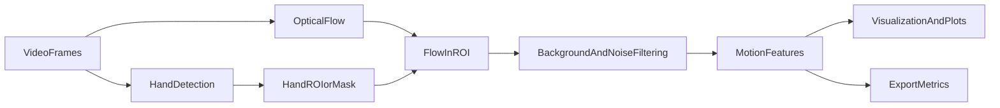

# Détection et analyse du mouvement par flot optique guidé par objets

Ce projet combine **détection de main** (brique sémantique) et **flot optique** (brique dynamique) pour estimer et qualifier le mouvement: **vitesse**, **direction**, **amplitude**, et états **arrêt/reprise**.

## Architecture (pipeline)



## 1) Détection de la main (brique sémantique)

### A. Détecteur générique type YOLO (bounding box)
- **Sortie**: `bbox + score + classe`.
- **Avantages**
  - **Rapidité** et bonne robustesse générale.
  - **Simple**: une bbox suffit pour restreindre le flot à une zone utile.
  - **Extensible**: multi-objets (main, personne, etc.) si le modèle le permet.
- **Inconvénients**
  - **Fond inclus** dans la bbox (pixels statiques → bruit; caméra mobile → flot “fond”).
  - **Pas de structure** (pas de landmarks) → moins adapté aux gestes fins.

### B. Détecteur spécialisé MediaPipe Hands (landmarks / squelette)
- **Sortie**: **21 landmarks** (et un tracking temporel implicite).
- **Avantages**
  - **Sélection fine du flot**: masque via **convex hull** des landmarks (bien moins de fond qu’une bbox).
  - **Descripteurs gestes**: angles/écartement doigts, orientation paume, etc.
  - **Stabilité**: souvent moins de “jitter” qu’une bbox brute.
- **Inconvénients**
  - Peut décrocher en cas d’**occultations**, poses extrêmes, gants, etc.
  - Multi-mains: gestion d’ID à prévoir si nécessaire.

### Recommandation pragmatique
- **Premier prototype orienté “main”**: **MediaPipe Hands** (meilleur signal utile, filtrage plus simple).
- **Prototype généraliste / multi-objets**: **YOLO** + filtrage robuste dans la bbox.

### Réduire l’impact du fond si on n’a qu’une bbox
1. **Masque de mouvement** via magnitude du flot (seuil fixe ou adaptatif).
2. **Soustraction du mouvement global** (médiane robuste de `(u,v)` dans la ROI) pour limiter l’effet caméra/fond.
3. **Plus grand composant connexe** dans le masque de mouvement (retire les pixels parasites dispersés).

## 2) Choix de l’algorithme de flot optique (moteur de mouvement)

### A. Lucas–Kanade (sparse, local)
- **Principe**: conservation de luminance + linéarisation \(I_x u + I_y v + I_t = 0\), résolu en moindres carrés dans une fenêtre autour de **points d’intérêt**.
- **Type de flot**: **sparse** (vecteurs sur features trackées).
- **Pour la vitesse moyenne**: efficace si la main contient assez de texture/coins; instable sinon (peu de points, blur).

### B. Farnebäck (dense, classique)
- **Principe**: approximation polynomiale locale (quadratique) + pyramide multi-échelle.
- **Avantages**: **dense**, bon compromis **précision/coût**, très pratique via OpenCV.
- **Limites**: sensible au flou / grands déplacements; mélange main/fond aux frontières → filtrage indispensable.

### C. RAFT (deep learning)
- **Principe**: volume de corrélation + raffinement itératif (update operator).
- **Robustesse**: meilleur sur grands déplacements et blur (selon modèle).
- **Contraintes**: dépendances PyTorch, GPU recommandé si on vise le temps réel.

### Recommandation hiérarchisée
- **Prototype CPU**: Farnebäck + filtrage robuste.
- **Baseline légère**: LK pyramidal (comparatif).
- **Version robuste**: RAFT (comparaison qualité vs coût).

## 3) Association et filtrage du flot (cœur mathématique)

### Algorithme (bbox ou masque)
1. **Extraire le flot** dans la ROI (bbox) ou appliquer le **masque** (MediaPipe hull).
2. **Magnitude** \(m=\sqrt{u^2+v^2}\) et **angle** \(\theta=\text{atan2}(v,u)\).
3. **Seuil** \(m>\tau\)
   - fixe (webcam stable), ou
   - adaptatif (Otsu sur \(m\), ou \(\\tau=\\text{median}(m)+k\\cdot\\text{MAD}(m)\)).
4. **Masque de mouvement** + morphologie (ouvrir/fermer) + **plus grand composant**.
5. **Supprimer le fond**: estimer \(\vec{w}_{bg}\) (médiane robuste) et soustraire \(\vec{w}\leftarrow\vec{w}-\vec{w}_{bg}\).
6. **Vélocité**: moyenne/quantiles de \(m\) sur pixels valides.
7. **Direction dominante (angles cycliques)**: moyenne circulaire pondérée
   - \(C=\sum w_i\cos\theta_i\), \(S=\sum w_i\sin\theta_i\), \(\theta^*=\text{atan2}(S,C)\)
   - concentration \(R=\\frac{\\sqrt{C^2+S^2}}{\\sum w_i}\) (si faible → mouvement non directionnel/oscillation/bruit).

## 4) Plan de développement (PoC → robuste)

### Étape 1 — ROI manuelle + Farnebäck
- **Objectif**: valider “flot → filtrage → métriques → viz”.
- **Validé**: vitesse(t) cohérente, direction stable en translation, bruit fortement réduit par seuil adaptatif.

### Étape 2 — Détection YOLO (bbox)
- **Objectif**: automatiser ROI.
- **Validé**: stabilité bbox, filtrage fond dans bbox, FPS raisonnable.

### Étape 3 — RAFT (comparaison)
- **Objectif**: robustesse grands déplacements / blur.
- **Validé**: cohérence flot sur main, stabilité métriques, analyse coût/latence.

## Exécuter

### Installation (Poetry)
```bash
poetry install
```

### Démo live (ROI manuelle par défaut)
```bash
poetry run doma-live --source 0 --flow farneback --detector manual
```

### MediaPipe Hands (optionnel)
```bash
poetry install -E hand
poetry run doma-live --source 0 --flow farneback --detector mediapipe
```

### YOLO (optionnel, nécessite un modèle compatible “hand” ou une classe pertinente)
```bash
poetry install -E yolo
poetry run doma-live --source 0 --flow farneback --detector yolo
```

### RAFT (optionnel)
```bash
poetry install -E raft
poetry run doma-live --source 0 --flow raft --detector mediapipe
```


