# Dynamic Object Motion Analysis (DOMA)

Détection et analyse du mouvement par **flot optique** guidé par la main, puis **classification de gestes** (IPN Hand). Le pipeline associe détection de main (MediaPipe / YOLO), flot optique (Farnebäck / RAFT) et modèles séquence→classe (CNN-LSTM, Temporal Transformer, ST-GCN).

---

## Table des matières

- [Dynamic Object Motion Analysis (DOMA)](#dynamic-object-motion-analysis-doma)
  - [Table des matières](#table-des-matières)
  - [À propos](#à-propos)
  - [Structure du projet](#structure-du-projet)
  - [Installation](#installation)
  - [Données](#données)
    - [Labels (14 classes)](#labels-14-classes)
    - [Aperçu](#aperçu)
    - [Sorties du pipeline](#sorties-du-pipeline)
    - [Création du dataset](#création-du-dataset)
  - [Entraînement](#entraînement)
  - [Inférence en direct](#inférence-en-direct)
  - [Analyse des logs](#analyse-des-logs)
  - [Documentation](#documentation)
  - [Références](#références)

---

## À propos

1. **Détection** — ROI main (manuelle, MediaPipe ou YOLO) pour limiter le flot à la zone utile.
2. **Flot optique** — Farnebäck ou RAFT, filtrage (seuil, soustraction fond), métriques (vitesse, direction, concentration).
3. **Données** — Par sample : pose/cinématique + features de flot → manifest (`manifest.csv`) → entraînement.
4. **Modèles** — CNN-LSTM, Temporal Transformer, ST-GCN, ST-GCN-Opt, Temporal ViT ; un script (`doma-train`) et inférence live (`doma-live-classifier`).

---

## Structure du projet

```
├── config/                 # Labels, config datasets (ipn_hand)
├── data/
│   ├── raw/                # Vidéos brutes, index, annotations
│   ├── processed/          # manifest.csv, pose/*.npz, optflow/*.npz
│   └── interim/
├── doma/
│   ├── cli.py              # doma-live (démo flot)
│   ├── detectors.py        # ROI manuelle, MediaPipe, YOLO
│   ├── flow.py             # Farnebäck, RAFT
│   ├── motion.py           # Métriques mouvement
│   ├── dataloaders/        # build_dataloaders, build_dataloaders_stgcn
│   ├── datasets/           # Construction dataset IPN Hand
│   ├── modeling/           # train.py (registry, run_train)
│   ├── models/             # cnn_lstm, temporal_transformer, stgcn, stgcn_opt, temporal_vit
│   ├── live_classifier.py  # doma-live-classifier
│   └── tools/              # analyze_live_logs
├── docs/
├── models/                 # Runs (run_id/best.pt, metrics.json, …)
├── notebooks/
├── scripts/
└── pyproject.toml
```

---

## Installation

- **Python** 3.12+, **uv** (ou Poetry).

```bash
uv sync
# avec détection main + dataset + entraînement :
uv sync --extra hand --extra dataset --extra train
```

**CLI** : `doma-live`, `doma-build-dataset`, `doma-train`, `doma-live-classifier`.

---

## Données

**Dataset** : [IPN Hand](https://gibranbenitez.github.io/IPN_Hand/) — reconnaissance continue de gestes de la main, 4 000+ séquences, 800 000 frames, 50 sujets, 640×480 @ 30 fps. Le pipeline lit les vidéos et produit, par sample, des fichiers **pose** et **optflow** normalisés.

### Labels (14 classes)

Définis dans `config/labels.py` (LABELS, LABEL_TO_TEXT, LABEL_TO_ID). Référence : [IPN Hand](https://gibranbenitez.github.io/IPN_Hand/), ICPR 2020.

| Id | Label | Description |
|----|-------|-------------|
| 0 | D0X | Non-gesture |
| 1 | B0A | Pointing with one finger |
| 2 | B0B | Pointing with two fingers |
| 3 | G01 | Click with one finger |
| 4 | G02 | Click with two fingers |
| 5 | G03 | Throw up |
| 6 | G04 | Throw down |
| 7 | G05 | Throw left |
| 8 | G06 | Throw right |
| 9 | G07 | Open twice |
| 10 | G08 | Double click with one finger |
| 11 | G09 | Double click with two fingers |
| 12 | G10 | Zoom in |
| 13 | G11 | Zoom out |

### Aperçu

<p align="center">
  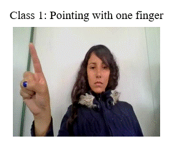 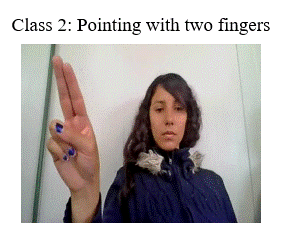 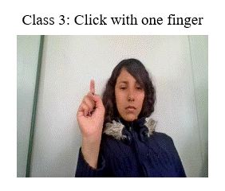 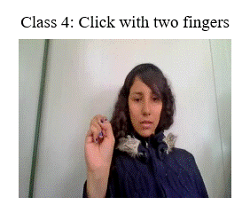 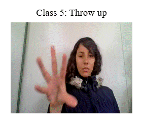
</p>
<p align="center">
  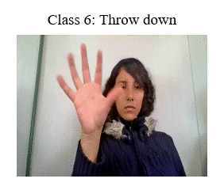 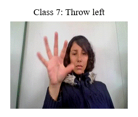 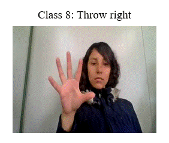 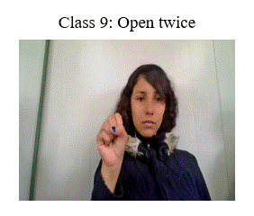 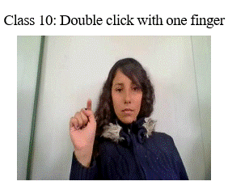
</p>
<p align="center">
  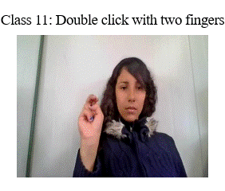 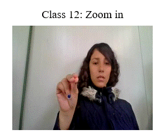 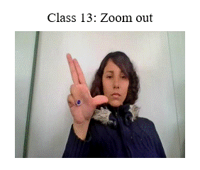
</p>

### Sorties du pipeline

Pour chaque sample :

- **`pose_*.npz`** — Track 3D (position, vitesse, accélération), optionnel 21 landmarks main (MediaPipe).
- **`optflow_*.npz`** — Métriques de flot (vitesse moyenne/max, direction dominante, concentration, seuil).

ST-GCN / stgcn_opt utilisent les **mêmes** fichiers : le pose est lu en skeleton+motion (et en track pour stgcn_opt), l’optflow tel quel. Donc **skeleton+motion** et **track+optflow** = représentations dérivées de **pose + optflow**.

Le **manifest** (`data/processed/manifest.csv`) liste tous les samples : `sample_id`, `split`, `label`, `pose_npz`, `optflow_npz` (chemins relatifs à la racine).

### Création du dataset

Voir `docs/DATASET_CREATION.md` et `config/datasets.yaml` (section `ipn_hand`). Vidéos brutes dans `data/raw/ipn_hand/` :

```bash
uv run doma-build-dataset --config config/datasets.yaml --only ipn_hand --subset 10
```

---

## Entraînement

Un seul script : **`doma-train`**. Le dataloader et le format de batch dépendent du modèle.

**Modèles** : tous consomment le manifest ; la forme des entrées varie (pose+optflow unifiés, ou pose en skeleton/motion/track + optflow).

| Modèle | Entrée |
|--------|--------|
| `temporal_transformer` | Séquence pose+optflow (vecteur unifié) |
| `cnn_lstm` | Features unifiées pose+optflow |
| `stgcn` | Pose en skeleton+motion |
| `stgcn_opt` | Pose en skeleton/motion/track + optflow |
| `temporal_vit` | Frames de flot (IPN flow) |

**Exemples** :

```bash
uv run doma-train --model temporal_transformer --manifest data/processed/manifest.csv --epochs 20 --batch-size 32 --output-dir models
uv run doma-train --model stgcn --epochs 20 --batch-size 32 --output-dir models
uv run doma-train --model cnn_lstm --epochs 20 --batch-size 32 --output-dir models
```

**Options** : `--root-dir`, `--split-mode` (train_val_test | train_test), `--max-len`, `--lr`, `--save-best-by` (accuracy | f1_macro | f1_weighted).

**Sortie** : un dossier `models/<model>_<date>_<heure>/` avec `best.pt`, `metrics.json`, `train_log.log`, `model_config.json`, `train_config.json`, `label_map.json`, et éventuellement `norm.npz`. Détails : `docs/TRAINING_GUIDE.md`.

---

## Inférence en direct

Classification en temps réel (webcam ou vidéo) avec un run entraîné (recommandé : cnn_lstm ou temporal_transformer) :

```bash
uv run doma-live-classifier --run models/<run_id> --source 0
```

- **q** : quitter — **r** : reset.

Options : `--window-ms`, `--infer-every-ms`, `--ema`, `--d0x-thr`, `--mirror-view`, `--flip-features`, `--log`, `--log-dir`. Sessions enregistrées sous `doma/sessions/` (CSV, TXT, optionnel NPZ).

---

## Analyse des logs

Résumé d’une session live :

```bash
uv run python -m doma.tools.analyze_live_logs --csv doma/sessions/<session>/report_*.csv --out doma/sessions/<session>/analysis_summary.json
```

Avec segments annotés (CSV : `t_start_ms,t_end_ms,label`) pour confusion et latence :

```bash
uv run python -m doma.tools.analyze_live_logs --csv doma/sessions/<session>/report_*.csv --segments segments.csv --out doma/sessions/<session>/analysis_with_segments.json
```

---

## Documentation

| Fichier | Contenu |
|---------|---------|
| `docs/DATASET_CREATION.md` | Création du dataset IPN Hand |
| `docs/TRAINING_GUIDE.md` | Dataloaders, modèles, entraînement |
| `config/labels.py` | LABELS, LABEL_TO_TEXT, LABEL_TO_ID |

---

## Références

- **IPN Hand** : [gibranbenitez.github.io/IPN_Hand](https://gibranbenitez.github.io/IPN_Hand/)
- Détection : MediaPipe Hands, YOLO (Ultralytics) — Flot : Farnebäck (OpenCV), RAFT

---

*Projet DOMA — Flot optique et classification de gestes (IPN Hand).*
