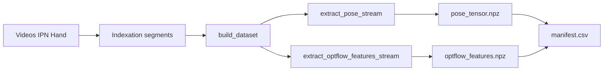

# Rapport complet du projet DOMA — Classification continue de gestes

**Dynamic Object Motion Analysis** : application du flot optique et du deep learning pour la classification catégorielle de gestes discrets (IPN Hand), de la création du dataset à l’évaluation du modèle finetuné.

---

## 1. Introduction

Ce projet vise à **détecter et classifier des gestes de la main** en temps réel à partir d’un flux vidéo (webcam), en s’appuyant sur :

- une **brique sémantique** (détection de main : MediaPipe Hands) ;
- une **brique dynamique** (flot optique dense : Farnebäck) ;
- un **classifieur temporel** (CNN 1D + LSTM) entraîné sur des séquences de features pose + optflow.

Le pipeline global (voir [README.md](../README.md)) va des **frames vidéo** à la **détection de main**, au **flot dans la ROI**, au **filtrage** et aux **métriques de mouvement**, puis à l’**export** et à l’**entraînement** d’un modèle de classification. Le document de spécification détaillé (état de l’art, PRD, architecture) est décrit dans [.docs/Projet Flot Optique et Traduction Geste.md](../.docs/Projet%20Flot%20Optique%20et%20Traduction%20Geste.md).

Ce rapport récapitule **tout ce qui a été réalisé** : création du dataset, architecture du modèle, premier entraînement, sessions live, mode d’annotation pour évaluer la confusion et construire un mini-dataset, puis finetuning et pistes d’évolution. Chaque partie s’appuie sur les **fichiers et extraits de code** pertinents du dépôt.

---

## 2. Création du dataset

### 2.1 Vue d’ensemble du pipeline

Le dataset unifié produit, par sample, deux artefacts normalisés :

- **Pose / cinématique** : `pose_tensor.npz` (timestamps, position/vitesse/accélération du poignet, optionnellement landmarks 21 points).
- **Features de flot optique** : `optflow_features.npz` (vitesse moyenne/max, angle dominant, concentration de direction, etc.).

Un fichier `quality.json` et un **manifeste** `manifest.csv` complètent la base. Le guide opérationnel est dans [docs/DATASET_CREATION.md](DATASET_CREATION.md).



### 2.2 Téléchargement et structure des données brutes (IPN Hand)

- **Source** : jeu IPN Hand (vidéos + annotations officielles). Référence : [https://gibranbenitez.github.io/IPN_Hand/](https://gibranbenitez.github.io/IPN_Hand/) et [DATASET_CREATION.md](DATASET_CREATION.md).
- **Emplacement** :
  - Vidéos : `data/raw/ipn_hand/videos/**/*.(avi|mp4)`.
  - Annotations : `data/raw/ipn_hand/annotations/` avec les fichiers officiels :
    - `Video_TrainList.txt` / `Video_TestList.txt`
    - `Annot_TrainList.txt` / `Annot_TestList.txt`
    - `classIdx.txt`

**Indexation** : un sample = **un segment** (début/fin en numéros de frames, inclusifs). Le split **val** est créé en sous-échantillonnant le TRAIN au niveau vidéo (`val_ratio`, `seed` dans `config/datasets.yaml`).

Code clé — recherche du dossier d’annotations et construction des samples par segment :

**Fichier** : [doma/datasets/indexers/ipn_hand.py](../doma/datasets/indexers/ipn_hand.py)

- `_find_ipn_annotations_dir(ann_root)` : repère un dossier contenant `Annot_TrainList.txt`, `Annot_TestList.txt`, `Video_TrainList.txt`, `Video_TestList.txt`, `classIdx.txt`.
- `_index_ipn_segments(...)` : lit les listes, crée un `SampleIndex` par segment (train/val/test).
- `_make_segment_sample(...)` : crée un `SampleIndex` avec `frame_start`, `frame_end`, `parent_video`, `source_annotation`.

Extrait (création d’un sample segment) :

```python
# doma/datasets/indexers/ipn_hand.py, _make_segment_sample
return SampleIndex(
    sample_id=sample_id,
    dataset="ipn_hand",
    split=split,
    label=label,
    source_uri=rel,
    video_path=str(vp),
    frame_start=int(t_start),
    frame_end=int(t_end),
    parent_video=video,
    source_annotation=str(ann_path.as_posix()),
    num_frames=int(frames),
)
```

### 2.3 Ingestion du flux vidéo et extraction des primitives

Le **builder** itère sur les samples et appelle `process_sample` pour chaque entrée. Les frames sont limitées au segment via `iter_video_frames_range` lorsque `frame_start` et `frame_end` sont présents.

**Fichier** : [doma/datasets/builder.py](../doma/datasets/builder.py)

Extrait — itérateur de frames (segment IPN) et appel pose / optflow :

```python
# doma/datasets/builder.py, process_sample
def _frame_iter():
    count = 0
    start_1 = sample.frame_start
    end_1 = sample.frame_end
    # ...
    if vid_path.is_dir():
        it = iter_frames_dir(vid_path, fps=fps)
    else:
        if start_1 is not None and end_1 is not None:
            it = iter_video_frames_range(
                vid_path,
                start_1=int(start_1),
                end_1=int(end_1),
            )
        else:
            it = iter_video_frames(vid_path)
    for fr in it:
        yield fr
        # ...

# Pose
raw_pose = extract_pose_stream(_frame_iter(), cfg=pose_cfg)
t_reg, pos, vel, acc, lms, valid, meta = build_pose_tensor(
    raw_pose, dt_ms=cfg.dt_ms
)
PoseTensor(...).to_npz(pose_path)

# Optflow
t_reg, feats, valid, meta = extract_optflow_features_stream(
    _frame_iter(), cfg=flow_cfg
)
OptFlowFeatures(...).to_npz(flow_path)
```

**Pose (MediaPipe)** — [doma/datasets/pose.py](../doma/datasets/pose.py) :

- `extract_pose_stream(frames, cfg)` : utilise `MediaPipeHandsDetector` (backend `hands`), parcourt les frames, détecte bbox + landmarks 21 points, normalise l’origine (premier poignet), optionnellement rotation (wrist → middle MCP). Sortie : `PoseExtractResult` (t_ms, track_xyz, landmarks_xyz, valid).
- `build_pose_tensor(pose, dt_ms)` : rééchantillonnage linéaire sur grille `dt_ms`, dérivation pour vitesse et accélération, production de `PoseTensor` (timestamps_ms, track_pos_xyz, track_vel_xyz, track_acc_xyz, landmarks_xyz, valid).

Configuration : [config/datasets.yaml](../config/datasets.yaml) — `processing.mediapipe` (backend, max_num_hands, min_detection_confidence, min_tracking_confidence), `processing.dt_ms` (ex. 33.333 ms ≈ 30 FPS).

**Flot optique (Farnebäck)** — [doma/datasets/optflow.py](../doma/datasets/optflow.py) :

- `extract_optflow_features_stream(frames, cfg)` :
  - Détection main par **MediaPipe** (bbox + masque optionnel), ROI recadrée et redimensionnée (`roi_size` 224×224).
  - Calcul du flot dense entre frames successives : `farneback(prev_roi, roi_gray)` (module [doma/flow](../doma/flow)).
  - Application du masque main (si fourni), puis `compute_motion_stats` : magnitude, seuil (fixe ou MAD), masque de mouvement → **avg_speed**, **max_speed**, **dominant_angle_deg**, **direction_concentration**, **n_pixels**, **threshold**, et **valid** (mouvement significatif).

Le pipeline dataset **par défaut** n’utilise pas YOLO ; le README mentionne YOLO comme option pour la démo live (`--detector yolo`).

**Schéma des artefacts** — [doma/datasets/schema.py](../doma/datasets/schema.py) :

- `PoseTensor` : timestamps_ms, track_pos_xyz, track_vel_xyz, track_acc_xyz, landmarks_xyz (optionnel), valid, meta ; `to_npz()` pour `pose_tensor.npz`.
- `OptFlowFeatures` : timestamps_ms, avg_speed, max_speed, dominant_angle_deg, direction_concentration, n_pixels, threshold, valid, meta ; `to_npz()` pour `optflow_features.npz`.

**Sorties** : `data/processed/<dataset>/<split>/<sample_id>/` contient `pose_tensor.npz`, `optflow_features.npz`, `quality.json`. Le manifeste est écrit via [doma/datasets/manifest.py](../doma/datasets/manifest.py) (`write_manifest_csv`).

**Commande** :

```bash
poetry run doma-build-dataset --config config/datasets.yaml --only ipn_hand --subset N
```

---

## 3. Architecture du modèle (CNN temporel + LSTM)

### 3.1 Objectif et choix architecturaux

- **Objectif** : classification **catégorielle** de formes discrètes (labels IPN : D0X, B0A, B0B, G01–G11) à partir de **séquences temporelles** de features (pose + optflow), et non une tâche séquence-à-séquence. Référence des labels et statistiques : [docs/labels.md](labels.md).
- **Conv1D temporel** : réduction du bruit et extraction de motifs **locaux dans le temps** (kernel 5, 2 couches, 128 canaux). Adapté à des gestes dont la dynamique courte (fenêtre de quelques centaines de ms) est discriminante.
- **LSTM** : modélisation des **dépendances longues** dans la fenêtre ; **bidirectionnel** pour utiliser le contexte passé et futur ; sortie agrégée par **pooling moyen masqué** sur la séquence (et non seulement la dernière étape), ce qui stabilise la prédiction pour des gestes de longueur variable.
- **Tête** : LayerNorm, Dropout, Linear → logits (14 classes). Entrée : tenseur `(B, T, F)` avec F = 79 (pose + optflow + landmarks selon config d’entraînement).

### 3.2 Implémentation

**Fichier** : [doma/models/cnn_lstm.py](../doma/models/cnn_lstm.py)

- `ModelConfig` : in_features, num_classes, conv_channels, conv_layers, conv_kernel, conv_dropout, lstm_hidden, lstm_layers, bidirectional, lstm_dropout, head_dropout.
- `ConvBlock` : Conv1d → BatchNorm1d → GELU → Dropout.
- `CNNLSTM` :
  - Conv 1D : entrée `(B, T, F)` transposée en `(B, F, T)`, puis séquence de ConvBlocks, puis transposée en `(B, T, C)`.
  - LSTM : `pack_padded_sequence` pour ignorer le padding, LSTM bidirectionnel, `pad_packed_sequence`.
  - Pooling : `_masked_mean(out, lengths)` → vecteur (B, C’).
  - Head : LayerNorm → Dropout → Linear → logits.

Extrait du forward :

```python
# doma/models/cnn_lstm.py, CNNLSTM.forward
def forward(self, x: "torch.Tensor", lengths: "torch.Tensor") -> "torch.Tensor":
    x = x.transpose(1, 2)  # (B,F,T)
    x = self.conv(x)      # (B,C,T)
    x = x.transpose(1, 2) # (B,T,C)
    lengths_cpu = lengths.to(dtype=torch.long, device="cpu").clamp_min(1)
    packed = nn.utils.rnn.pack_padded_sequence(
        x, lengths_cpu, batch_first=True, enforce_sorted=False
    )
    packed_out, _ = self.lstm(packed)
    out, _ = nn.utils.rnn.pad_packed_sequence(packed_out, batch_first=True)
    pooled = _masked_mean(out, lengths.to(device=out.device))
    return self.head(pooled)
```

**Données d’entrée** — [doma/dataloaders/gesture_features.py](../doma/dataloaders/gesture_features.py) et [doma/dataloaders/dataloader.py](../doma/dataloaders/dataloader.py) : lecture du manifest, chargement des NPZ (pose + optflow), construction du vecteur de features (pose : pos/vel/acc, optionnel landmarks ; optflow : avg_speed, max_speed, angle en sin/cos, direction_concentration, n_pixels, threshold), masquage des timesteps invalides, padding, normalisation (moyenne/écart-type depuis le train).

Les hyperparamètres du run sont consignés dans [docs/REPORT_CNN_LSTM.md](REPORT_CNN_LSTM.md) (model_config, train_config).

---

## 4. Résultats du premier entraînement

- **Run** : `runs/classify_20260305-211230` (checkpoint, norm.npz, model_config.json, train_config.json, training_curves.png, confusion_matrix.png).
- **Données** : IPN Hand, `data/processed/manifest.csv`, 14 classes (B0A, B0B, D0X, G01–G11).
- **Métriques (test)** — voir [docs/REPORT_CNN_LSTM.md](REPORT_CNN_LSTM.md) :
  - **Accuracy** : ≈ 0,753  
  - **Macro-F1** : ≈ 0,694  
  - **Micro-F1** : ≈ 0,753  

Détails par classe : B0A/B0B (F1 ≈ 0,93–0,95) très bons ; D0X recall plus faible (≈ 0,56) ; G01 et G11 en precision faible (≈ 0,32–0,31), reflétant des confusions (clics, zoom out). G04, G07, G09, G10 ont des F1 > 0,71.

**Commentaire** : performance correcte sur données labellisées **déjà segmentées** (IPN). L’écart avec les conditions **live** (fenêtre glissante, bruit, variabilité utilisateur, flip, état persistant) est attendu et a motivé le mode annotation et le finetuning décrits plus bas.

---

## 5. Premières sessions de live tests

- **Sessions** : dossiers sous [doma/sessions/](../doma/sessions/) (ex. `live_20260307-135728`, `live_20260307-135942`) avec :
  - `report_live_*.csv` (par frame, prédiction courante + top-k),
  - `report_live_*.txt` (config + résumé),
  - `dump_live_*.npz` (x_seq, probs, ema_probs par inférence).
- **Diagnostic** : [docs/LIVE_CLASSIFIER_DIAGNOSTIC.md](LIVE_CLASSIFIER_DIAGNOSTIC.md) décrit les **mismatchs** principaux :
  - **Flip miroir** : si l’affichage est en miroir mais pas les features, les gestes directionnels (throw left/right) peuvent être inversés.
  - **État persistant non réinitialisé** : origine pose, `prev_roi` optflow, buffer temporel, EMA des probabilités restent sur toute la session ; changement de main ou perte de main dégrade les prédictions.
  - **Drop des timesteps faible mouvement** : les frames où l’optflow est invalide peuvent être exclues, ce qui pénalise D0X et les gestes courts (clics).
- **Réglages recommandés** : fenêtre 500–900 ms (latence) ou 900–1500 ms (stabilité), stride 50–200 ms, EMA 0.0–0.3 (clics) ou 0.5–0.7 (gestes longs), cohérence flip affichage / flip features.

L’historique de diagnostic et de propositions (logging, reset, benchmark) est documenté dans le transcript d’agent référencé dans le plan (session live + logging + benchmark).

---

## 6. Mode annotation et mini-dataset pour finetuning

### 6.1 Mode `--annotations`

**Activation** (logging obligatoire) :

```bash
poetry run doma-live-classifier --run runs\classify_20260305-211230 --source 0 --log-dir doma\sessions --annotations
```

**Code** : [doma/live_classifier.py](../doma/live_classifier.py)

- Argument `--annotations` (l.1206), vérification que `--no-log` n’est pas utilisé (l.1285–1287).
- Une classe dédiée gère l’UI d’annotation (boutons, raccourcis clavier), les répertoires `ann_dir`, `captures.jsonl`, `segments.csv`, `dataset_dir`, `manifest_csv`.
- **Capture** : au déclenchement (bouton ou touche), la fenêtre temporelle est extraite depuis un ring buffer (pre + post), puis :
  - Construction de `PoseTensor` et `OptFlowFeatures` **au même format** que le dataset (pose_tensor.npz, optflow_features.npz, quality.json),
  - Écriture dans `data/annotated/<session_name>/train/<sample_id>/`,
  - Ajout d’une ligne au `manifest.csv` du dataset annoté (sample_id, dataset=annotated, split=train, label=gt_label, source_uri, pose_npz, optflow_npz, quality_json).

Extrait conceptuel (export pose/flow et ligne manifest) — autour des lignes 845–905 :

- Écriture de `PoseTensor` et `OptFlowFeatures` avec meta `source: live_annotations`, `session`, `capture_id`, `gt_label`.
- `quality.json` avec pose_valid_ratio, optflow_valid_ratio, t_start_wall_ms, t_end_wall_ms.
- Ligne ajoutée à `_manifest_rows` et `_save_manifest()`.

**Fichiers de session** : [doma/sessions/live_20260307-135942/annotations/](../doma/sessions/live_20260307-135942/annotations/) — `captures.jsonl`, `segments.csv`, `confusion_counts.json`, et les NPZ par sample dans le dataset annoté.

### 6.2 Analyse des 182 captures (session live_20260307-135942)

Résumé produit par [scripts/analyze_annotated_session.py](../scripts/analyze_annotated_session.py) avec `--session doma/sessions/live_20260307-135942` et `--dataset data/annotated/live_20260307-135942`, ou lu depuis un fichier `analysis_summary.json` équivalent :

- **182 captures** (lignes dans captures.jsonl / manifest).
- **Validité** : pose ≈ 0,98 (très bon), optflow ≈ 0,70 (correct).
- **Confusion (majorité)** : **accuracy ≈ 32,4 %** (59/182) — le modèle initial (`classify_20260305-211230`) est très loin des gestes réels de cette session.
- **Répartition des labels** : B0A, B0B, D0X, G01–G11 (détail dans analysis_summary.json, ex. G10: 30, G11: 19, B0A: 23, etc.).
- **Rappel par classe** (trié du plus faible au plus fort) : G10, B0B, G03, G05, G04 à 0 % ; G07, D0X, G11, G01 partiellement corrects ; G08, G02, G09 à 100 % (sur ce jeu).

Cela justifie un **ré-entraînement ciblé** (finetuning) sur le mini-dataset annoté.

### 6.3 Mini-dataset et split pour ré-entraînement

- **Dataset annoté** : `data/annotated/live_20260307-135942/` — `manifest.csv` + sous-dossiers `train/<sample_id>/` avec pose_tensor.npz, optflow_features.npz, quality.json.
- **Split** : [scripts/datasets/split_manifest_csv.py](../scripts/datasets/split_manifest_csv.py) — par ex. `--manifest data/annotated/live_20260307-135942/manifest.csv` avec `--train 0.8 --val 0.1 --test 0.1 --stratify label` → `manifest.splits.csv` (colonnes split train/val/test) utilisé comme entrée pour le finetuning.

---

## 7. Résultats du modèle finetuné

- **Run** : [runs/finetune_live_20260307-135942](../runs/finetune_live_20260307-135942).
- **Config** : [runs/finetune_live_20260307-135942/train_config.json](../runs/finetune_live_20260307-135942/train_config.json)  
  - `init_ckpt`: `runs/classify_20260305-211230/checkpoints/best.pt`  
  - `manifest_csv`: `data/annotated/live_20260307-135942/manifest.splits.csv`  
  - epochs 30, batch 16, lr 0.0001, dropout 0.3.

**Chargement du checkpoint** — [doma/modeling/train.py](../doma/modeling/train.py) : si `init_ckpt` est renseigné, `torch.load(ckpt_path)` et `model.load_state_dict(ckpt["model"], strict=True)` pour initialiser le modèle avant l'entraînement., `torch.load(ckpt_path)` et `model.load_state_dict(ckpt["model"], strict=True)` pour initialiser le modèle avant l’entraînement.

**Métriques** :

- [runs/finetune_live_20260307-135942/test_metrics.json](../runs/finetune_live_20260307-135942/test_metrics.json) et **annotated_test_metrics.json** :
  - **Accuracy** : 0,90  
  - **Macro-F1** : 0,70  
  - Sur un petit ensemble de test (ex. 20 samples dans test_metrics) ; plusieurs classes ont un support 0 en test (G04, G06, etc.), donc F1 non défini pour celles-ci.

**Commentaire** : **nette amélioration** sur le sous-ensemble annoté (90 % accuracy vs ~32 % en “majorité” avec l’ancien modèle sur les mêmes types de gestes). Les métriques sont à interpréter avec prudence (peu d’échantillons, déséquilibre des classes, possible surajustement au domaine de la session). L’évaluation “annotated” reflète toutefois mieux le comportement attendu sur les gestes réels de l’utilisateur ayant effectué la session.

---

## 8. Conclusion et évolutions possibles

Le projet couvre un pipeline complet : **données brutes IPN Hand** → **indexation par segments** → **extraction pose (MediaPipe) + flot optique (Farnebäck)** → **artefacts normalisés** → **entraînement CNN-LSTM** → **inférence live** → **annotation** → **analyse de confusion** → **finetuning** sur données annotées.

**Pistes d’évolution** :

- **Données** : davantage de sessions annotées, augmentation, alignement strict live/dataset (flip, règle de validité, fenêtre/stride).
- **Modèle** : ablations (sans accélération, sans optflow, sans landmarks), Transformer temporel, seuil de confiance / rejet.
- **Live** : seuils D0X, hystérésis, motion gating, calibration par utilisateur.
- **Pipeline** : RAFT/WAFT en option pour le flot, Re-ID si multi-mains.

**Références** : [README.md](../README.md), [docs/DATASET_CREATION.md](DATASET_CREATION.md), [docs/REPORT_CNN_LSTM.md](REPORT_CNN_LSTM.md), [docs/LIVE_CLASSIFIER_DIAGNOSTIC.md](LIVE_CLASSIFIER_DIAGNOSTIC.md), [docs/labels.md](labels.md), [.docs/Projet Flot Optique et Traduction Geste.md](../.docs/Projet%20Flot%20Optique%20et%20Traduction%20Geste.md).
